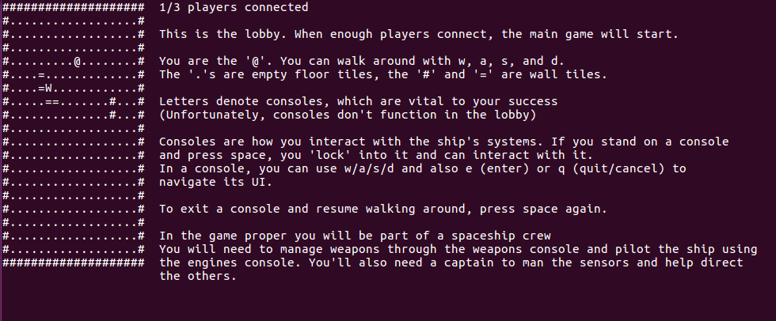
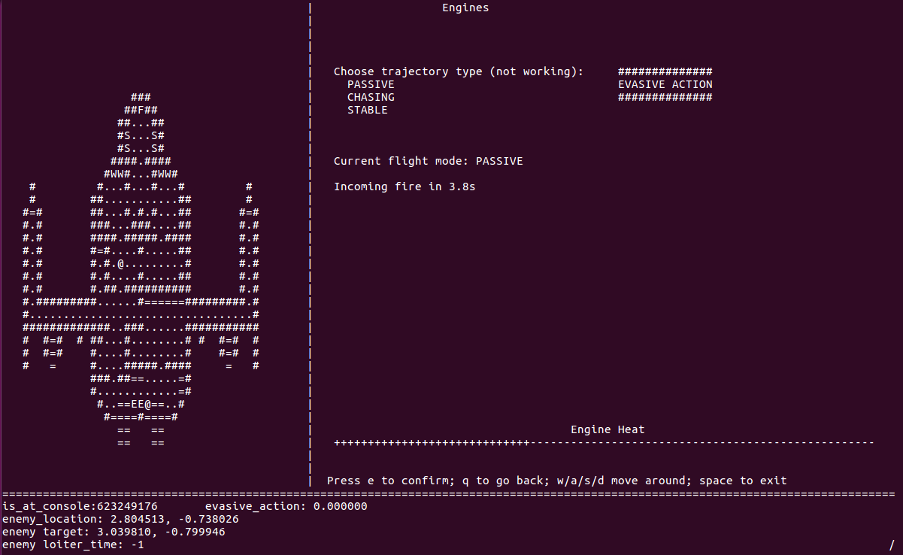

# Objects in Space
Spaaaaaaaaaaaaaaaaaaaaaaaaaaaaaaaaaaaaaaace

Members
-------
* Vanessa Yan
* George Vorobyev
* Wilbur Zhao
* Hyunwoo Jeung

Pd 4
----

Instructions
------------
* WASD to move, spacebar to enter/exit UIs (consoles)
* In consoles, WASD to move, E to confirm, Q to go back
* Requires 3 players together with the ability to talk to each other and cooperate

Extra Instructions
------------------
* NCurses needed

Files
-----
* client.c/.h
* consoles.c/.h
* consoles.c/.h
* controller.c/.h
* effects.c/.h
* encounter.c/.h
* main_game.c/.h
* main_structs.h
* Makefile
* ship_layout.txt
* socket_util.c/.h
* startup.c/.h
* util.c/.h

Design Docs
-----------
 * [Code Design](https://docs.google.com/document/d/1IgatDz_6722brVV7fFIwvBEq5ark7zgIoqw6d45vSGQ/edit?usp=sharing)
 * [Planning](https://docs.google.com/document/d/19gbqSTsz3DaU1Bog9vDDGnbJoEudQRNv5XVAje69cCo/edit?usp=sharing)

How to Run
----------
./space --server
./space --client -ipxxx.xxx.xxx.xxx
note - connects on port 9998

Pretty Pictures
---------------

Game Lobby

Main game

